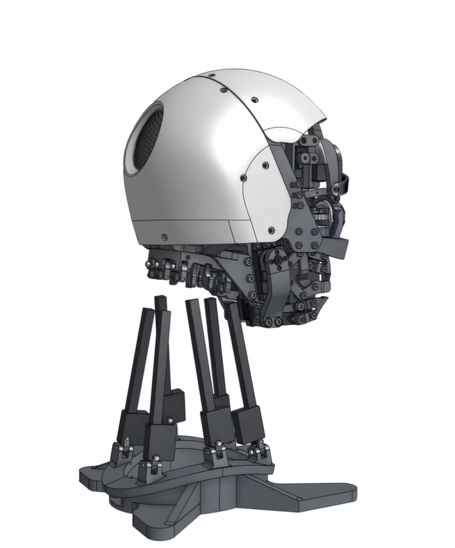
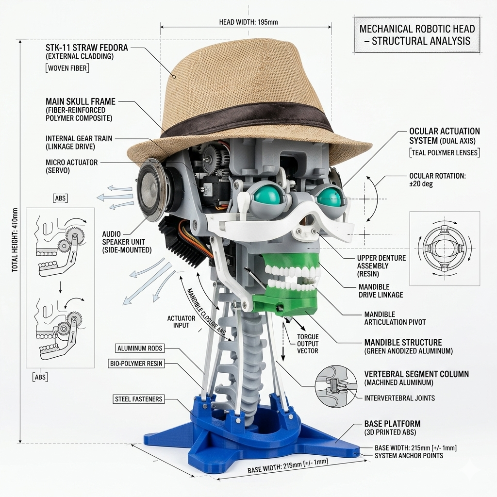

<div align="center">


<br/>

# 🤖 Humanoid Robot

**An open-source AI-powered robot with real-time voice conversation, expressive servo-driven facial animations, and a fully 3D-printed chassis — built on Raspberry Pi 4.**

<br/>

[](https://python.org)
[](https://raspberrypi.org)
[](LICENSE)
[](https://github.com/ayushshah-xo/Humanoid-Robot-/stargazers)

</div>

---

## What is this?

A fully functional humanoid robot built from scratch — mechanical design, embedded hardware, and AI software — by a student. It listens to you, thinks, responds aloud, and moves its face to match.

No cloud subscriptions. No black-box kits. Every part designed, printed, and coded by hand.

<br/>

<div align="center">

|  |  |  |
|:---:|:---:|:---:|
| **Built Robot** | **CAD Design** | **System Flow** |

</div>

---

## Features

| | |
|---|---|
| 🎤 **Voice I/O** | Listens via mic, responds via speaker |
| 🧠 **AI Brain** | Online + offline conversation modes |
| 😐 **Facial Expressions** | Servo-driven eyes, eyebrows, and mouth |
| ⚡ **Real-time** | Low-latency speech-to-response pipeline |
| 🧩 **Modular** | Swap hardware or swap AI model independently |
| 🖨️ **3D Printed** | Every structural part is printable and remixable |

---

## How it works

```
You speak
   ↓
Speech Recognition  ──── converts audio to text
   ↓
AI Model  ──────────────  generates a response
   ↓
Text-to-Speech  ─────────  synthesizes audio
   ↓
Speaker output  +  Servo animation  (synced mouth movement)
```

The servo controller runs in a separate thread so facial animation stays in sync with audio playback without blocking the main pipeline.

---

## Hardware

| Component | Purpose |
|---|---|
| Raspberry Pi 4 | Main compute |
| Servo motors (×3) | Face actuation |
| Servo driver board | PWM control via I²C |
| USB microphone | Speech input |
| Speaker + amplifier | Audio output |
| 5V regulated supply | Motor power |
| 3D printed chassis | Structure |

> Wiring guide and GPIO pin map are in [`docs/hardware-setup.md`](docs/hardware-setup.md)

---

## Getting started

**Requirements:** Python 3.9+, Raspberry Pi OS (64-bit recommended)

```bash
# 1. Clone
git clone https://github.com/ayushshah-xo/Humanoid-Robot-.git
cd Humanoid-Robot-

# 2. Install dependencies
pip install -r requirements.txt

# 3. Configure (copy and edit)
cp config.example.yaml config.yaml

# 4. Run
python3 main.py
```

> **First time?** See [`docs/quickstart.md`](docs/quickstart.md) for a step-by-step walkthrough including hardware connection and audio device setup.

---

## Project structure

```
Humanoid-Robot-/
├── main.py               # Entry point
├── config.example.yaml   # Configuration template
├── requirements.txt
│
├── core/
│   ├── speech.py         # Mic input + ASR
│   ├── ai.py             # LLM interface
│   ├── tts.py            # Text-to-speech
│   └── servo.py          # Servo controller
│
├── cad/                  # All 3D printable files (.stl / .step)
│
├── assets/images/        # Photos and diagrams
│
└── docs/                 # Hardware setup, quickstart, wiring
```

---

## CAD & 3D printing

All structural files are in [`/cad`](cad/). Designed to be:

- Printed on any FDM printer (PLA recommended)
- Assembled with standard M3 hardware
- Modular — replace individual parts without reprinting everything

---

## Roadmap

- [ ] Face recognition — recognize known people
- [ ] Emotion AI — adapt expression to conversation tone
- [ ] Mobile app — wireless control and monitoring
- [ ] Locomotion — basic autonomous movement

---

## Contributing

Issues, pull requests, and forks are welcome.

If you improve a module or add a new one, open a PR — this project is meant to be remixed.

---

## Author

**Ayush Shah** — [github.com/ayushshah-xo](https://github.com/ayushshah-xo)

---

<div align="center">

If this project helped you or inspired you — a ⭐ goes a long way.

</div>
