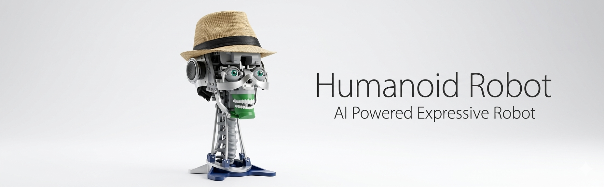

# Brain Neural Link

<div align="center">



[](https://python.org)
[](https://raspberrypi.org)
[](LICENSE)
[](#current-status)

</div>

Brain Neural Link is an experimental, non-invasive Brain-Computer Interface (BCI) research project focused on exploring how people might interact with digital systems without relying on touchscreens, keyboards, or conventional physical controls. The project is intentionally grounded in realism: it studies the path from outside-the-head EEG signal acquisition, through signal conditioning and processing, to AI-assisted intent classification and device control.

This repository is a practical research foundation and a prototype testbed. It currently contains a Python-based embedded interaction system built around a Raspberry Pi, servo-driven face motion, voice interaction, and AI-assisted response generation. These pieces reflect the same broad design philosophy as Brain Neural Link: sense intent, interpret it, and turn it into action — even if the current implementation is not yet a full EEG wearables platform.

> Important: Brain Neural Link does not claim to read every thought or replace all human movement. The project is about exploring a small set of reliable, non-invasive interactions and improving them through research and iterative validation.

---

## Project identity

Brain Neural Link is an experimental, non-invasive Brain-Computer Interface (BCI) research project dedicated to understanding how people might interact with digital systems using external neural signals rather than touch or conventional physical controls.

The project is intentionally grounded in realism: it explores the path from outside-the-head EEG acquisition, through signal conditioning and processing, to AI-assisted intent recognition and digital interaction.

## Main purpose

The long-term goal is to investigate more natural, touch-free interaction with digital devices in ways that may help accessibility and hands-free control.

In practical terms, the project explores future methods of interacting with technology without depending entirely on:

- Touchscreens
- Keyboards
- Mice
- Touchpads
- Conventional physical controls

The design target is a comfortable, lightweight, removable, portable, and aesthetically considered wearable that can gather non-invasive EEG data and help translate a user’s focus or intent into commands for a digital system. This is not a medical device, not a guarantee of perfect control, and not a claim of mind-reading.

A major near-term research aim is accessibility: creating more inclusive interfaces for people who may have difficulty using standard physical input methods. Another goal is to study natural, hands-free operation for everyday devices and assistive applications.

---

## Development philosophy

> Start small. Prove one reliable interaction. Improve accuracy. Expand gradually.

This principle guides the project. Instead of trying to claim full control of a computer or smartphone immediately, the early work focuses on a small number of reliable interactions that can be validated under real conditions.

Examples of research directions include:

- Navigation
- Selection
- Scrolling experiments
- Next/previous actions
- Custom command mapping
- Signal quality monitoring
- Real-time EEG visualization
- User calibration
- Machine-learning experiments
- False-command reduction

The project is intentionally iterative: measure what works, improve reliability, then expand the supported interaction set.

---

## Current status

The repository is best understood as an evolving foundation rather than a finished EEG product. The current implementation is a working prototype platform for human-machine interaction research.

### 1. Currently implemented features

These are directly represented by the code in this repository:

- Raspberry Pi 4-based control system
- Servo-driven facial animation for jaw and brow motion
- Microphone-based voice input via Python and SpeechRecognition
- Text-to-speech output using espeak
- AI-backed conversation via Groq when internet is available
- Offline AI fallback via Ollama
- Real-time interaction loop for speaking and responding
- 3D-printable robot head / wearable-inspired mechanical structure in the `cad/` directory

### 2. Prototype features

These are early, exploratory ideas represented by the project’s structure and workflow:

- Expressive human-facing interaction prototypes
- Conversation-driven command experiments
- Head and face motion as a visible feedback layer
- Real-time audiovisual interaction loops
- Calibration-style tuning of hardware and prompts

### 3. Planned features

These are realistic next steps for the project, but not yet fully implemented in the repository:

- Dry EEG sensor integration
- Signal-quality tracking
- Non-invasive EEG acquisition hardware research
- AI model tuning for intent classification
- Calibration dashboards and user profiling
- More structured BCI command mapping

### 4. Long-term research goals

- Portable, non-invasive EEG wearable prototypes
- Comfortable headband or headphone-inspired hardware form factors
- Edge AI processing on smartphone or laptop for performance and affordability
- Reliable command sets for assistive technology and hands-free control
- Research into practical, low-noise acquisition and validation workflows

---

## System architecture

The codebase already demonstrates the general pattern the project is exploring: sense input, process it, generate an action, and provide feedback.

```text
Audio / Speech Input
       ↓
Speech Recognition
       ↓
AI / Model Reasoning
       ↓
Text-to-Speech
       ↓
User Feedback + Action Output
       ↓
Servo / Mechanical Response
```

This is a strongly related concept to a future BCI stack, but the current implementation is audio-first rather than EEG-first.

The actual repository pipeline in `main.py` is:

```text
Microphone
  ↓
Speech-to-text
  ↓
Groq or Ollama response generation
  ↓
TTS with espeak
  ↓
Servo-driven jaw / eyebrow motion
```

This provides a working interaction loop and serves as a research sandbox for intent-driven human-machine interfacing.

---

## Hardware direction

The long-term hardware direction for Brain Neural Link is a non-invasive wearable BCI platform. The target system would ideally resemble a comfortable headband or headphone-inspired device rather than a large laboratory EEG setup.

A realistic future architecture would include:

- Non-invasive dry EEG sensors
- Low-noise analog front-end electronics
- Signal conditioning and filtering
- High-resolution analog-to-digital conversion
- Low-power microcontroller or processor
- Bluetooth Low Energy or similar wireless communication
- Rechargeable battery
- Lightweight wearable enclosure

The current repository already demonstrates a real hardware prototype style:

- Raspberry Pi 4 as the compute layer
- PCA9685 driver for servo control
- USB microphone and speaker for interaction tests
- 3D-printed structure and head geometry in `cad/`

A key affordability strategy is to investigate moving computationally intensive AI processing to the user’s existing smartphone or computer when appropriate, while the wearable focuses on signal acquisition, conditioning, and wireless transmission.

---

## EEG development strategy

The project should be developed in stages. Rather than jumping directly to custom hardware, the realistic path is:

```text
Existing EEG Device
       ↓
Collect and Study EEG Data
       ↓
Signal Processing Software
       ↓
AI / Machine Learning Research
       ↓
Reliable Prototype Commands
       ↓
Custom Hardware Research
       ↓
Integrated Wearable Prototype
```

This approach allows the team to learn from real EEG data, study quality and noise characteristics, test signal processing algorithms, and refine patterns before committing to custom wearable hardware.

The current repository does not include a production-ready EEG system. Instead, it demonstrates the broader research and engineering pattern needed for a future BCI project: data collection, software pipelines, inference, and interaction feedback.

Existing hardware and ecosystem tools may be used to understand:

- Signal quality
- Data collection workflows
- EEG processing techniques
- Machine learning and classification
- User calibration approaches
- Real-world BCI interaction patterns

This is a research path, not a claim that existing commercial hardware is being copied or repackaged.

---

## Technology and research landscape

### CGX

CGX is relevant to the broader research landscape because it represents the class of dry-electrode, research-grade EEG systems and multi-channel acquisition platforms commonly used in advanced neurotechnology work. Concepts relevant to this project include:

- Dry EEG electrodes
- Multi-channel signal acquisition
- Low-noise electronics
- High-resolution analog-to-digital conversion
- Wireless communication
- Access to raw EEG data for experimentation

This project does not claim partnership or affiliation with CGX. It is included as a comparison point for technical direction and research context.

### BrainLink Pro

BrainLink Pro is relevant as a possible accessible or affordable non-invasive EEG platform for experimentation. Depending on SDK or API availability and compatibility, it may be useful for exploratory data collection, early protocol development, or calibration studies.

It is treated as an external technology for research comparison and prototyping evaluation, not as part of Brain Neural Link unless the repository later includes a direct integration.

### Neuralink

Neuralink is fundamentally different from Brain Neural Link.

- Neuralink represents an implanted BCI approach.
- Brain Neural Link is designed around the idea of a non-invasive, external, removable, and portable system.

This project is explicitly exploring a non-invasive path and does not claim Neuralink-level neural resolution or implant-grade capabilities.

### Brain Products / BrainVision

Brain Products and BrainVision are relevant because they are established names in EEG recording, signal visualization, data analysis, and neurophysiological research. Their ecosystem is useful for understanding standards, workflows, and research-grade instrumentation in the broader BCI field.

These vendors are referenced only as contextual research references, not as affiliations or project partners.

---

## Electron integration

This repository does not currently include a real Electron application implementation. The active codebase is Python-driven and hardware-oriented rather than a desktop application built with Electron.

That said, if Electron were introduced in a future iteration, its role would likely be:

- A desktop control surface for calibration and signal inspection
- Visualization of EEG or sensor streams
- A GUI for settings, device management, and experiment control
- A bridge between hardware and analysis workflows

In a future architecture, the logical split would be:

- Main process: device access, process management, serial or Bluetooth communication, and application lifecycle
- Renderer process: user interface for experiment control, monitoring, and visualization
- Preload layer: secure bridge between the browser UI and native Node/Electron APIs

At the moment, however, the repository does not contain that Electron implementation. The real working foundation here is the Python application in `main.py`, along with the hardware and CAD components.

---

## Repository layout

```text
.
├── README.md
├── main.py                  # Main Python interaction loop
├── config.example.yaml      # Example runtime configuration
├── requirements.txt         # Python dependency list
├── docs/
│   ├── hardware-setup.md    # Raspberry Pi and servo hardware notes
│   ├── quickstart.md        # Setup and installation steps
│   └── hardware-setup.pdf   # Reference documentation
├── cad/                     # 3D printable and mechanical design assets
├── assets/
│   ├── images/
│   └── facial-expressions.mp4
└── .gitignore               # Ignored local secrets and runtime configuration
```

---

## Getting started

This repository is designed to run on a Raspberry Pi with a Python environment and hardware peripherals.

### Requirements

- Python 3.9+
- Raspberry Pi 4 or similar single-board computer
- Servo hardware and PCA9685 driver
- USB microphone
- Speaker or audio output device
- Internet access for Groq or local Ollama runtime for offline inference

### Install

```bash
git clone https://github.com/ayushshah-xo/Robotic_Head.git
cd Robotic_Head
python3 -m venv .venv
source .venv/bin/activate
pip install -r requirements.txt
cp config.example.yaml config.yaml
```

### Configure

Edit `config.yaml` and set your values for:

- Groq API key
- Audio output card
- Input microphone device
- Servo movement parameters
- AI model preferences

### Run

```bash
python3 main.py
```

For step-by-step hardware and system setup, see:

- `docs/quickstart.md`
- `docs/hardware-setup.md`

---

## System components and current implementation

The repository currently captures several important ideas relevant to Brain Neural Link research:

- Sensing input from the environment
- Interpreting it with an AI model or signal pipeline
- Generating a response or action
- Providing feedback to the user through speech and motion

That pattern is a useful stepping stone toward more advanced BCI research, even though the current codebase is not yet a non-invasive EEG controller.

---

## Research constraints and honest scope

This project should be presented with appropriate technical humility:

- It explores a future direction in human-computer interaction.
- It is not a claim to read thoughts or perfectly replace physical control.
- It is not an established medical or clinical device.
- It is an experimental engineering and research effort.

The goal is not to promise universal control. The goal is to prove one reliable interaction at a time and expand from there.

---

## Roadmap

- [x] Voice interaction loop and AI response generation
- [x] Servo-driven face movement and feedback
- [x] Raspberry Pi-based prototype environment
- [x] Mechanical and hardware exploration in `cad/`
- [ ] EEG sensor integration research
- [ ] Signal quality monitoring and calibration pipeline
- [ ] Driver/command mapping for hands-free device control
- [ ] Custom wearable research prototype
- [ ] Accessible assistive interaction studies

---

## Contributing

Contributions are welcome if they improve the system, expand the research foundation, refine the interaction model, or help document the engineering path.

This project is best treated as a collaborative research effort where careful experimentation matters more than rapid claims.

---

## Acknowledgment

Brain Neural Link is an exploratory research project focused on non-invasive human-machine interaction and accessible technology.

The current repository provides a grounded prototype foundation and demonstrates the engineering mindset behind the broader concept.

If you are exploring wearables, human-computer interaction, AI, or assistive interfaces, this project is a practical example of how a disciplined prototype can evolve into a deeper research platform.
